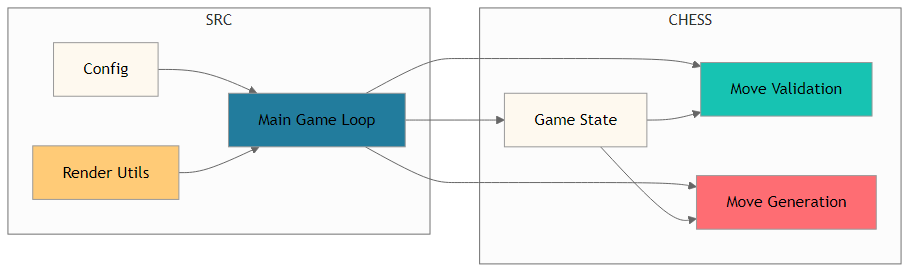

# CHESS.NN 🚀♟️

**Next-generation Python chess application with a Pygame UI and a modular chess engine**

CHESS.NN brings together a real-time, interactive chess board powered by Pygame and a robust, fully-featured chess engine. Whether you’re a developer building chess utilities, a gamer seeking a lightweight desktop opponent, or a researcher integrating chess logic into AI workflows, CHESS.NN has you covered.

---

## 📖 Project Overview

**Problem Statement**  
Many open-source chess projects either focus on UI or engine logic—but seldom both in a cohesive, easy-to-extend package.

**Solution Approach**  
CHESS.NN delivers a unified codebase with:
- A Pygame-driven UI for rendering and input ([src/](./src/))  
- A standalone chess engine for move validation, game state management, legal move generation, castling rights, and move history ([chess/](./chess/))

**Key Benefits**  
- 🎮 Interactive, flicker-free board powered by Pygame  
- ♟️ Modular engine with clear API for move generation and state tracking  
- 🛠️ Clean separation: UI logic in `src/`, engine logic in `chess/`  
- ⚙️ Easily scriptable for AI training or automated analysis  

**Target Audience**  
- Python game developers  
- AI/ML researchers needing a reliable chess backend  
- Hobbyists building custom chess tools  

---

## 🏗️ Architecture & Design

### System Overview  
CHESS.NN is composed of two primary modules:

1. **src** – Handles rendering, event loop, and user interaction  
2. **chess** – Implements core chess logic, including pieces, rules, and utilities  

When you launch the app, `src/main.py` initializes Pygame, draws the board and pieces (via [src/graphics.py](./src/graphics.py)), and delegates move validation to the engine in [chess/engine.py](./chess/engine.py).

### Component Architecture  
```text
┌─────────────────────────────────────────────┐
│                  Application               │
│ ┌──────────────┐   ┌──────────────────────┐ │
│ │  src Module  │──▶│  chess Module         │ │
│ │              │   │                      │ │
│ │  • main.py   │   │  • engine.py         │ │
│ │  • graphics.py│   │  • pieces.py         │ │
│ │  • config.py │   │  • utils.py          │ │
│ └──────────────┘   └──────────────────────┘ │
└─────────────────────────────────────────────┘
```

### Architecture Diagram  
  
*Figure: High-level overview of CHESS.NN’s module interactions*

---

## 💻 Technology Stack

| Layer           | Technology |
|-----------------|------------|
| Programming     | Python     |
| Graphics & I/O  | Pygame     |

---

## 📁 Module Organization

### src Module ([Documentation](./src/README.md))  
- [src/config.py](./src/config.py): Configuration constants (board size, colors, FPS)  
- [src/graphics.py](./src/graphics.py): Utilities for drawing the board, pieces, and highlighting moves  
- [src/main.py](./src/main.py): Entry point — initializes Pygame, handles the main game loop  

### chess Module ([Documentation](./chess/README.md))  
- [chess/engine.py](./chess/engine.py): Core engine for move validation, legal-move generation, game-state tracking (castling, en passant, history)  
- [chess/pieces.py](./chess/pieces.py): Class definitions for each chess piece, movement rules, and values  
- [chess/utils.py](./chess/utils.py): Helper functions (FEN parsing, notation conversion, board indexing)  

---

## 🚀 Getting Started

### Prerequisites  
- Python 3.8 or newer  
- Pygame (for graphics and input handling)

### Installation  

1. Clone the repository  
   ```bash
   git clone https://github.com/yourname/CHESS.NN.git
   cd CHESS.NN
   ```

2. Install Pygame  
   ```bash
   python3 -m pip install pygame
   ```

### Quick Start  
Launch the interactive chess application:  
```bash
python3 src/main.py
```

You should see a chessboard window where you can click to move pieces. Illegal moves are automatically prevented by the engine.

---

## 📚 Usage Guide

### Basic Operations  
- **Move Pieces**: Click and drag or click-select then click to destination  
- **Visual Hints**: Legal moves are highlighted, courtesy of `src/graphics.py`  
- **Game State**: The engine in `chess/engine.py` enforces rules (castling, promotion, en passant)

### Advanced Features  
- **Standalone Engine**  
  If you’d like to integrate just the engine, import it directly:
  ```python
  import chess.engine as engine
  # See the chess module README for API details
  ```
- **Custom Configuration**  
  Tweak constants in [src/config.py](./src/config.py) to change board colors, window size, or frame rate.

### Best Practices  
- Keep UI and engine logic separated to simplify testing and extensions  
- Use FEN strings (via `chess/utils.py`) to load/save positions in your own tools  

---

## 🤝 Contributing

Thank you for your interest in contributing to CHESS.NN! We welcome enhancements, bug fixes, and documentation improvements.

1. Fork the repository  
2. Create a feature branch (`git checkout -b feature/YourFeature`)  
3. Commit your changes following PEP 8 style guidelines  
4. Push to your fork and open a Pull Request  

See [CONTRIBUTING.md](./CONTRIBUTING.md) for detailed guidance.

---

Embark on your next chess-coding adventure with CHESS.NN! 🚀🖤🧡