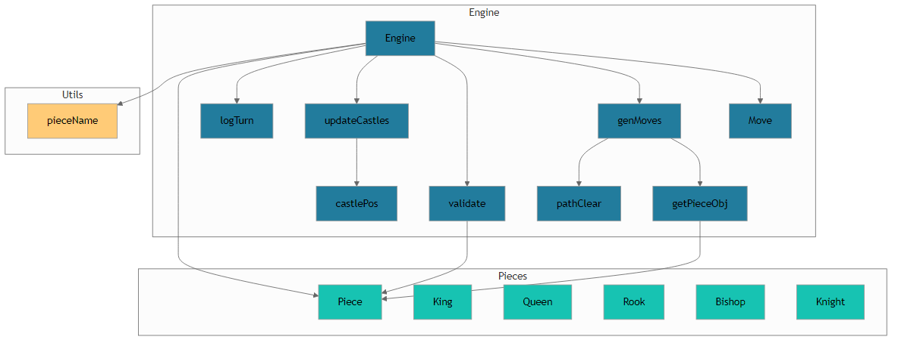

# Chess Module

A Python-based chess engine designed to validate moves, generate legal move sets, and manage game state—including castling rights and move history. This module offers a clear API for integrating chess logic into applications, UIs, or AI agents.

---

## Table of Contents

1. [Overview](#overview)  
2. [Architecture](#architecture)  
3. [Technology Stack](#technology-stack)  
4. [Core Components](#core-components)  
   - [Engine (engine.py)](#engine-enginepy)  
   - [Piece Definitions (pieces.py)](#piece-definitions-piecespy)  
   - [Utilities (utils.py)](#utilities-utilspy)  
5. [Getting Started](#getting-started)  
6. [API Reference](#api-reference)  
7. [Usage Examples](#usage-examples)  
8. [Related Documentation](#related-documentation)  

---

## Overview

The Chess Module encapsulates the rules and mechanics of chess in a concise Python implementation. Key features include:

- Generation of all legal moves for any board position  
- Validation of individual moves (including special moves such as castling)  
- Tracking of game state: piece positions, move history, and castling rights  
- Object-oriented representation of each piece type  

This module is intended for developers building chess applications, engines, analysis tools, or interactive clients.

---

## Architecture



The module is structured into three layers:

- **Engine Layer** (`engine.py`)  
  Central game logic, board state, move generation, and validation.  
- **Piece Layer** (`pieces.py`)  
  Individual piece classes (King, Queen, Rook, Bishop, Knight, Pawn) encapsulate movement rules.  
- **Utility Layer** (`utils.py`)  
  Helper functions such as human-readable piece naming.

---

## Technology Stack

- Python 3.7+  
- No external dependencies (pure-Python implementation)  
- Designed for easy integration into CLI, web, or GUI clients  

---

## Core Components

### Engine (engine.py)

Manages the overall game state and move logic.

Public Constants & Data Structures  
- `CHESS_BOARD`: Default board layout  
- `piece_map`, `piece_type`, `extra_info` (history, castling_rights)  

Key Functions  
- `_get_piece_object(position)`: Instantiate a piece based on its board symbol  
- `_is_path_clear(source, target)`: Check for obstructions on sliding moves  
- `_get_castle_pos(king_pos, side)`: Compute castling target squares  
- `gen_valid_moves(board, extra_info)`: Generate all legal moves for the active player  

Primary Classes  
- `Move(source_pos, target_pos, piece, capture=False)`: Represents a single move  
- `Engine(board=None, extra_info=None)`: Core game engine  

Engine Public Methods  
- `validate(move)`: Ensure a move conforms to chess rules  
- `update_castle(move)`: Adjust castling rights after a king or rook move  
- `log_turn(move)`: Record move in history and advance turn  

---

### Piece Definitions (pieces.py)

Defines behavior for each chess piece via class-based validation.

Base Class  
- `Piece(source_pos, target_pos, board, history, castling_rights)`  

Derived Classes & Public APIs  
- `King.validate()`, `Queen.validate()`, `Rook.validate()`, `Bishop.validate()`  
- `Knight.validate()`, `Pawn.validate()`  
- Each `validate` method enforces movement rules and captures  

Key Instance Variables  
- `self.source_pos`, `self.target_pos`  
- `self.source_piece`, `self.target_piece`  
- `self.history`, `self.castling_rights`  

---

### Utilities (utils.py)

Helper functions for board notation and piece representation.

Public Functions  
- `piece_name(row, col, piece)`: Convert board coordinates and piece symbol into human-readable names  

---

## Getting Started

1. Clone the repository:  
   ```bash
   git clone https://your.repo.url/chess-module.git
   cd chess-module
   ```  
2. Install any dependencies (none required for core engine).  
3. Integrate the module into your project by adjusting your `PYTHONPATH` or installing via setup script.  

---

## API Reference

### engine.gen_valid_moves(board, extra_info) → List[Move]
Return all legal moves from the given position.

### engine.Engine
- `__init__(board=None, extra_info=None)`: Initialize a new game or custom position  
- `validate(move)`: Validate a `Move` object  
- `update_castle(move)`: Update castling rights after king/rook moves  
- `log_turn(move)`: Record and apply the move  

### pieces.Piece & Derived Classes
- `validate()`: Check if the piece’s intended move is legal  

### utils.piece_name(row, col, piece) → str
Convert a piece and its coordinates into a standardized name (e.g., “White Knight at g1”).

---

## Usage Examples

```python
from chess.engine import Engine, gen_valid_moves, Move
from chess.utils import piece_name

# Initialize the engine with the standard starting position
engine = Engine()

# Generate all valid moves for the active player
moves = gen_valid_moves(engine.board, engine.extra_info)

# Inspect and apply a specific move
first_move = moves[0]
if engine.validate(first_move):
    engine.log_turn(first_move)
    engine.update_castle(first_move)
    print(f"Move logged: {first_move.source_pos} → {first_move.target_pos}")

# Display piece names
name = piece_name(0, 6, 'N')  # e.g., "White Knight at g1"
print(name)
```

---

## Related Documentation

- Architecture Diagram: `../readme_assets/chess_architecture.png`  
- Module Source Files:  
  - `engine.py` – Core game logic  
  - `pieces.py` – Piece movement rules  
  - `utils.py` – Helper utilities  

For deeper customization, refer to inline docstrings and function/type hints within each source file.