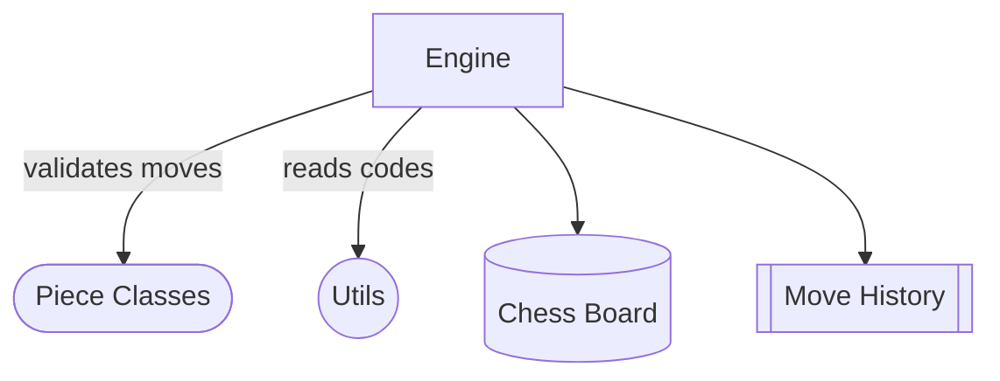

# Python Chess Engine

A lightweight, turn-based chess engine implemented in Python. It provides full move generation, validation, and execution for all standard pieces on an 8×8 board, including special rules like castling and en passant. The core modules separate board management, piece-specific logic, and utility functions to keep the design clear and extensible.

## File Overview

- [engine.py](engine.py)  
  Ties together board representation, move generation, validation, and execution.  
- [pieces.py](pieces.py)  
  Defines an abstract `Piece` base class and concrete subclasses for each chess piece’s move logic.  
- [utils.py](utils.py)  
  Utility functions such as `piece_name` for looking up the piece code at a given board coordinate.  

## Quick Start

```python
from engine import Engine
from utils import piece_name

# Initialize the game engine
engine = Engine()

# Inspect the starting board
board = engine.board
print(piece_name(board, (0, 1)))  # => 'wN' (white knight on b1)

# Generate all valid moves for the current side
moves = engine.gen_valid_moves()
for (pos, is_valid) in moves:
    if is_valid:
        print("Valid move to", pos)

# Validate and perform a specific move: e2 to e4
src = (6, 4)  # row 6, column 4  ⇒ 'e2'
dst = (4, 4)  # row 4, column 4  ⇒ 'e4'
valid, move_type = engine.move.validate(src, dst)
if valid:
    engine.perform_move(src, dst, move_type)
    print(f"Moved from {src} to {dst} ({move_type})")
else:
    print("Invalid move")
```

## Example: Pawn En Passant

```python
# Assuming the engine has just processed a double-step white pawn move
# black pawn at d4 may capture en passant
white_src = (6, 3)   # d2 → d4
white_dst = (4, 3)
engine.move.validate(white_src, white_dst)
engine.perform_move(white_src, white_dst, 'normal')

black_src = (4, 4)   # e4
black_dst = (5, 3)   # capture d4 en passant
valid, mtype = engine.move.validate(black_src, black_dst)
print(mtype)         # => 'en passant'
```

## Architecture Diagram

