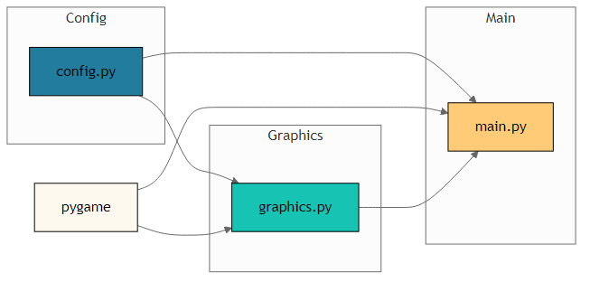

# src Module README

Welcome to the **src** module, the core of your chess application. This module provides configuration constants, rendering utilities, and the main game loop logic. It is built with Python and leverages Pygame for graphics and input handling.

---

## Table of Contents

1. Overview  
2. Module Components  
   - Configuration (config.py)  
   - Graphics (graphics.py)  
   - Main Application (main.py)  
3. Getting Started  
4. Usage Examples  
5. Architecture Diagram  
6. Dependencies  
7. Further Documentation

---

## 1. Overview

The **src** module encapsulates everything needed to configure, render, and run a chess game engine:

- **config.py**  
  Defines all fixed parameters for window size, board dimensions, and tile/piece sizing.

- **graphics.py**  
  Provides high-level drawing routines, sprite loading, and visual helpers for highlighting moves.

- **main.py**  
  Contains the `Chess` class, which initializes the game environment, processes user input, and advances the game loop.

---

## 2. Module Components

### 2.1 Configuration (config.py)

Holds all static configuration values used across the application:

Public Constants  
- `WIDTH`  
- `HEIGHT`  
- `BOARD_SIZE`  
- `TILE_SIZE`  
- `PIECE_SIZE`  
- …and three additional layout constants

Usage  
```python
from config import WIDTH, HEIGHT
# Initialize display with WIDTH x HEIGHT
screen = pg.display.set_mode((WIDTH, HEIGHT))
```

### 2.2 Graphics (graphics.py)

A set of drawing utilities to render the board, pieces, and UI highlights. Relies on Pygame for blitting and surface management.

Public API  
- `draw_rect(surface, color, rect)`  
- `load_pieces()`  
- `load_grid()`  
- `update_pieces(screen, board_state)`  
- `highlight_valid_moves(screen, moves, color)`  
- …and two other helper functions

Key Data Structures  
- `IMAGES` (dict mapping piece identifiers to Pygame surfaces)  
- `rect`, `pieces`, `image` (runtime variables for drawing)  
- Color constants such as `white`, `purple`, etc.

Example  
```python
import pygame as pg
from graphics import load_grid, update_pieces, highlight_valid_moves

# Draw board and pieces:
grid = load_grid()
screen.blit(grid, (0, 0))
update_pieces(screen, board_state)

# Highlight legal moves:
highlight_valid_moves(screen, valid_moves, color=purple)
```

### 2.3 Main Application (main.py)

Implements the `Chess` class, responsible for initializing Pygame, managing game state, handling user input, and driving the main loop.

Core Class: `Chess`

Methods  
- `__init__()`  
- `run()` — starts the game loop  
- `get_tile_under_mouse()`  
- `marked_moves_handler()`  
- `generate_moves()`  
- …and two additional internal handlers

Notable Attributes  
- `self.screen` (Pygame display surface)  
- `self.clock` (Pygame clock for frame regulation)  
- `self.white_to_move` (boolean tracking side-to-move)  
- `self.engine` (game logic/back-end interface)  
- `self.move` (current move state)  

Basic Usage  
```python
from main import Chess

if __name__ == "__main__":
    game = Chess()
    game.run()
```

---

## 3. Getting Started

1. Clone or download the repository.  
2. Ensure you have Python 3.x installed.  
3. Install dependencies:
   ```bash
   pip install pygame
   ```
4. From the project root:
   ```bash
   python -m src.main
   ```

---

## 4. Usage Examples

- Initialize the game and enter the main loop:
  ```bash
  python -m src.main
  ```
- Customize board dimensions via `config.py` constants.  
- Extend piece-loading by adjusting `IMAGES` in `graphics.py`.  
- Hook into `marked_moves_handler()` to attach AI or network play.

---

## 5. Architecture Diagram



The diagram above illustrates the flow between configuration, rendering utilities, and the main game engine.

---

## 6. Dependencies

- Python 3.x  
- Pygame (>=1.9.6)

Ensure these are installed and available in your environment before running the application.

---

## 7. Further Documentation

- Pygame Documentation: https://www.pygame.org/docs/  
- Project README (root): [See top-level README for full project details]  

For detailed API references and advanced configuration, refer to the docstrings in each module (`config.py`, `graphics.py`, `main.py`). If you make enhancements or fixes, please update those docstrings accordingly to keep the documentation in sync with code changes.