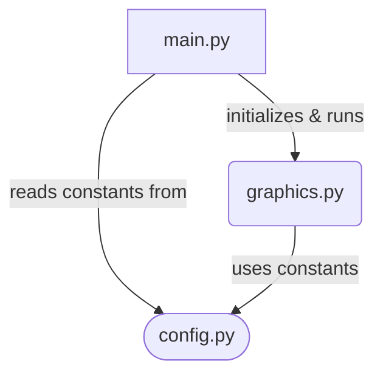

# Pygame Chess GUI

An interactive Chess GUI built with Python and Pygame. This project provides:

- A clean configuration module for all board and rendering constants  
- A graphics pipeline to draw the board, pieces, and move highlights  
- A main application that handles user input, drag-and-drop moves, and integrates with an external chess engine  

## Files

- [config.py](config.py)  
  Defines core constants:  
  • WIDTH, HEIGHT – window size (864×864)  
  • BOARD_SIZE – number of rows/columns (8)  
  • TILE_SIZE – size of each square in pixels  
  • PIECE_SIZE – 90% of a tile, for piece margins  
  • BOUNDS – 0-based max index (7)  
  • MAX_FPS – target frames per second (60)  
  • EMPTY – marker for empty squares ("--")

- [graphics.py](graphics.py)  
  Renders the chessboard and pieces using Pygame. Key functions:  
  • load_pieces() – preload and scale piece images  
  • load_grid(screen) – draw checkerboard  
  • update_pieces(screen, board) – blit each piece  
  • highlight_valid_moves(screen, valid_moves) – mark legal moves  
  • graphics(screen, board, highlighted) – full render pipeline

- [main.py](main.py)  
  Implements the `Chess` class:  
  • Initializes Pygame window, engine, clock, images  
  • Handles events: drag-and-drop, markers, quit  
  • Translates mouse to board tiles  
  • Queries engine for legal moves and applies them  
  • Runs the main loop and updates the display  

## Examples

### Run the game
```python
from main import Chess

if __name__ == "__main__":
    game = Chess()
    game.run()
```

### Inspect configuration
```python
from config import WIDTH, HEIGHT, BOARD_SIZE, TILE_SIZE, EMPTY

print(WIDTH, HEIGHT)              # 864 864
print(BOARD_SIZE, TILE_SIZE)      # 8 108
print("Empty marker:", EMPTY)     # Empty marker: --
```

### Basic rendering snippet
```python
import pygame
from graphics import load_pieces, graphics
from config import WIDTH, HEIGHT, BOARD_SIZE, EMPTY

pygame.init()
screen = pygame.display.set_mode((WIDTH, HEIGHT))

# Create an empty board
board = [[EMPTY for _ in range(BOARD_SIZE)] for _ in range(BOARD_SIZE)]
pieces = load_pieces()

# Draw initial state
graphics(screen, board, highlighted=[])
pygame.display.flip()
```

## Architecture

